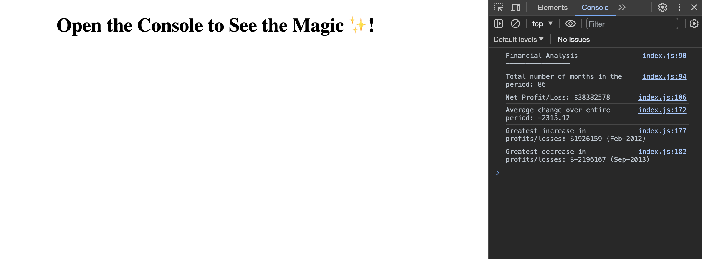

# Console Financial Analysis

This is the README file for my console financial analysis project. It provides information about the project, how to get to it, and other relevant details.

## Table of Contents

- [Description](#description)
- [Features](#features)
- [Installation](#installation)
- [Usage](#usage)
- [Technologies Used](#technologies-used)
- [License](#license)
- [Acknowledgments](#acknowledgments)
- [Contact](#contact)

## Description

This project analyses the financial records of a company using the provided financial database. 

## Features

Financial analysis provides:
- The total number of months included in the dataset.
- The net total amount of Profit/Losses over the entire period.
- The average of the **changes** in Profit/Losses over the entire period.
- The greatest increase in Profit/Losses (date and amount) over the entire period.
- The greatest decrease in Profit/Losses (date and amount) over the entire period.

## Installation

No installation is required.

To view the code files, you can Git Clone by following the instructions below:
1. Clone the repository: `https://github.com/jennysiu/consoleFinances`
2. Navigate to the project directory: `cd consoleFinances`
3. Open the `index.html` file in your preferred web browser.

## Usage

To view the financial analysis, open console on the deployed website here: `https://jennysiu.github.io/consoleFinances/`

Once the console is opened through the deploayed page, it should look something like this:

## Technologies Used

- HTML5
- JavaScript

## License

MIT License

Copyright (c) [2023] [Jenny Siu]

Permission is hereby granted, free of charge, to any person obtaining a copy of this software and associated documentation files (the "Software"), to deal in the Software without restriction, including without limitation the rights to use, copy, modify, merge, publish, distribute, sublicense, and/or sell copies of the Software, and to permit persons to whom the Software is furnished to do so, subject to the following conditions:

The above copyright notice and this permission notice shall be included in all copies or substantial portions of the Software.

THE SOFTWARE IS PROVIDED "AS IS", WITHOUT WARRANTY OF ANY KIND, EXPRESS OR IMPLIED, INCLUDING BUT NOT LIMITED TO THE WARRANTIES OF MERCHANTABILITY, FITNESS FOR A PARTICULAR PURPOSE AND NONINFRINGEMENT. IN NO EVENT SHALL THE AUTHORS OR COPYRIGHT HOLDERS BE LIABLE FOR ANY CLAIM, DAMAGES OR OTHER LIABILITY, WHETHER IN AN ACTION OF CONTRACT, TORT OR OTHERWISE, ARISING FROM, OUT OF OR IN CONNECTION WITH THE SOFTWARE OR THE USE OR OTHER DEALINGS IN THE SOFTWARE.

## Acknowledgments

- README template inspired by ChatGPT, an AI language model developed by OpenAI.
  (Note: Portions of this README were generated with assistance from ChatGPT.)

- Financial database is provided by EdX, my Bootcamp provider. 

## Contact
Feel free to reach out to me if you have any questions or feedback.

Jenny Siu
jenny.siu79@gmail.com
https://www.linkedin.com/in/jenny-siu-534576156/